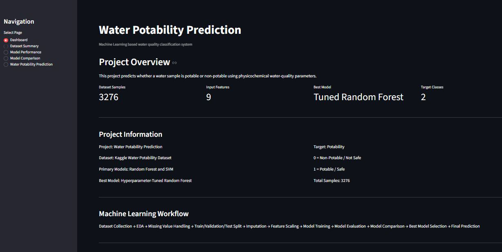
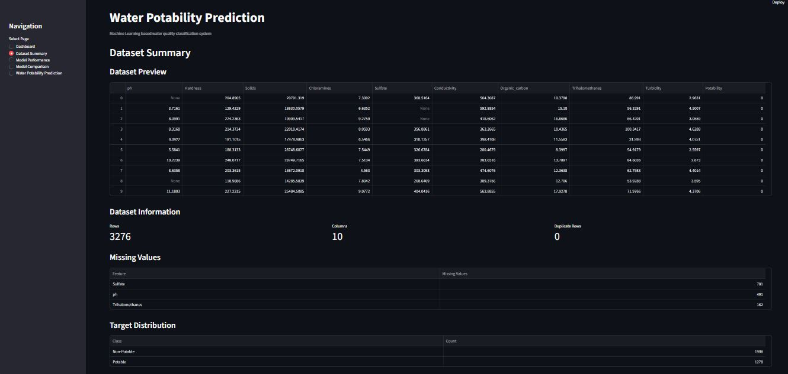
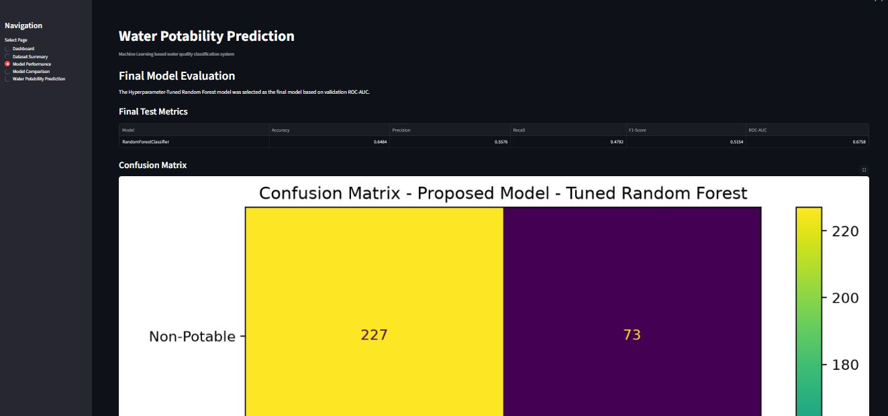
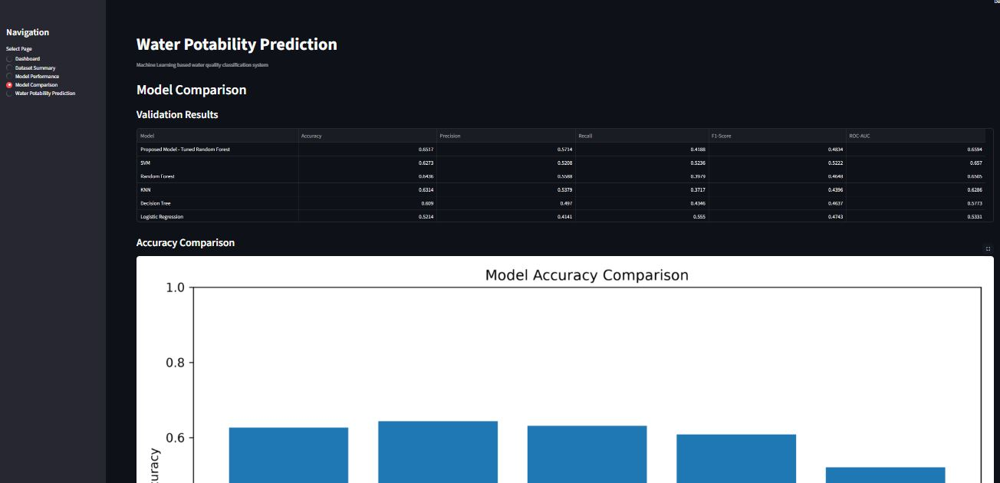
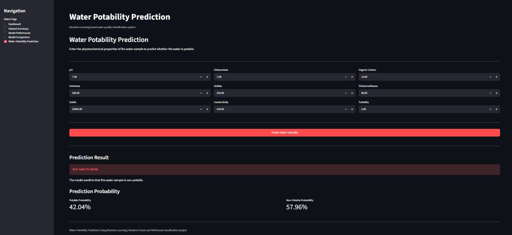

# Water Potability Prediction Using Machine Learning

A machine learning-based water quality classification system that predicts whether a water sample is Potable (Safe to Drink) or Non-Potable (Not Safe to Drink) using physicochemical water-quality parameters.

## Project Overview

This project analyzes the Kaggle Water Potability Dataset and compares multiple machine learning classification models.

Random Forest and Support Vector Machine (SVM) are implemented as compulsory models. A Hyperparameter-Tuned Random Forest is developed as the proposed model.

## Dataset

* Total Samples: 3276
* Input Features: 9
* Total Columns: 10
* Target Column: Potability
* Duplicate Rows: 0

### Input Features

1. pH
2. Hardness
3. Solids
4. Chloramines
5. Sulfate
6. Conductivity
7. Organic Carbon
8. Trihalomethanes
9. Turbidity

### Target Variable

* 0 = Non-Potable / Not Safe
* 1 = Potable / Safe

## Machine Learning Workflow

Dataset Collection → EDA → Missing Value Handling → Train/Validation/Test Split → Imputation → Feature Scaling → Model Training → Hyperparameter Tuning → Model Evaluation → Model Comparison → Final Prediction

## Data Preprocessing

The following preprocessing steps are performed:

* Dataset loading
* Duplicate-value checking
* Missing-value analysis
* Missing-value imputation
* Train-validation-test splitting
* Feature scaling
* Preparation of processed data for machine learning models

The preprocessing pipeline is saved using joblib so that the same transformations are applied during prediction.

## Machine Learning Models

The following models are compared:

1. Random Forest
2. Support Vector Machine (SVM)
3. Logistic Regression
4. Decision Tree
5. K-Nearest Neighbors (KNN)
6. Hyperparameter-Tuned Random Forest - Proposed Model

### Compulsory Models

* Random Forest
* Support Vector Machine (SVM)

### Proposed Model

The proposed model is a Hyperparameter-Tuned Random Forest.

GridSearchCV is used for hyperparameter optimization.

Best parameters:

* n_estimators = 300
* max_depth = 10
* max_features = sqrt
* min_samples_leaf = 1
* min_samples_split = 5

SVM is treated as a standard existing model and is not labelled as the proposed model.

## Evaluation Metrics

The models are evaluated using:

* Accuracy
* Precision
* Recall
* F1-Score
* ROC-AUC
* Confusion Matrix
* 5-Fold Cross-Validation

## Validation Results

| Model               | Accuracy | Precision | Recall | F1-Score | ROC-AUC |
| ------------------- | -------: | --------: | -----: | -------: | ------: |
| Tuned Random Forest |   0.6517 |    0.5714 | 0.4188 |   0.4834 |  0.6594 |
| SVM                 |   0.6273 |    0.5208 | 0.5236 |   0.5222 |  0.6570 |
| Random Forest       |   0.6436 |    0.5588 | 0.3979 |   0.4648 |  0.6505 |
| KNN                 |   0.6314 |    0.5379 | 0.3717 |   0.4396 |  0.6286 |
| Decision Tree       |   0.6090 |    0.4970 | 0.4346 |   0.4637 |  0.5773 |
| Logistic Regression |   0.5214 |    0.4141 | 0.5550 |   0.4743 |  0.5331 |

The Hyperparameter-Tuned Random Forest achieved the highest validation accuracy and precision among the compared models and was selected as the proposed model.

## Cross-Validation Results

5-fold cross-validation was performed using ROC-AUC.

| Model               | Mean ROC-AUC | Std. Deviation |
| ------------------- | -----------: | -------------: |
| SVM                 |       0.7037 |         0.0140 |
| Random Forest       |       0.6918 |         0.0174 |
| Tuned Random Forest |       0.6892 |         0.0213 |
| KNN                 |       0.6278 |         0.0113 |
| Decision Tree       |       0.5563 |         0.0243 |
| Logistic Regression |       0.4855 |         0.0181 |

SVM achieved the highest mean cross-validation ROC-AUC. However, the proposed model was selected based on overall validation performance rather than a single metric.

Differences from the base paper can occur because of preprocessing, missing-value handling, data splitting, hyperparameter settings, dataset distribution, and evaluation methodology.

## Final Test Results

The proposed Hyperparameter-Tuned Random Forest was evaluated on the unseen test dataset.

| Metric    | Result |
| --------- | -----: |
| Accuracy  | 64.84% |
| Precision | 55.76% |
| Recall    | 47.92% |
| F1-Score  | 51.54% |
| ROC-AUC   | 0.6758 |

### Final Confusion Matrix

|                    | Predicted Non-Potable | Predicted Potable |
| ------------------ | --------------------: | ----------------: |
| Actual Non-Potable |                   227 |                73 |
| Actual Potable     |                   100 |                92 |

The final confusion matrix and ROC curve are available in the outputs folder.

## Streamlit Dashboard

The project includes an interactive Streamlit dashboard with the following sections:

### Dashboard

Provides an overview of:

* Project information
* Dataset
* Target classes
* Selected model
* Machine learning workflow

### Dataset Summary

Displays:

* Dataset preview
* Dataset dimensions
* Duplicate rows
* Missing-value information
* Target distribution

### Model Performance

Displays:

* Final test metrics
* Confusion matrix
* ROC curve

### Model Comparison

Provides visual comparisons of:

* Accuracy
* F1-Score
* ROC-AUC
* Overall model performance

### Water Potability Prediction

Users can enter all nine water-quality parameters:

* pH
* Hardness
* Solids
* Chloramines
* Sulfate
* Conductivity
* Organic Carbon
* Trihalomethanes
* Turbidity

The application returns:

* Potable / Non-Potable prediction
* Potable probability
* Non-Potable probability

## Project Structure

```text
Water-Potability-ML/
|
|-- app.py
|-- README.md
|-- requirements.txt
|
|-- data/
|   |-- water_potability.csv
|
|-- models/
|   |-- best_model.joblib
|   |-- preprocessor.joblib
|
|-- outputs/
|   |-- validation_results.csv
|   |-- final_test_metrics.csv
|   |-- final_confusion_matrix.csv
|   |-- cross_validation_results.csv
|   |-- confusion_matrix.png
|   |-- roc_curve.png
|   |-- accuracy_comparison.png
|   |-- f1_comparison.png
|   |-- roc_auc_comparison.png
|   |-- model_comparison.png
|
|-- src/
    |-- preprocessing.py
    |-- train_models.py
```

## Requirements

The project requires Python and the following libraries:

* Streamlit
* Pandas
* NumPy
* Scikit-learn
* Joblib
* Matplotlib

All dependencies are listed in `requirements.txt`.

## Installation

Install the required dependencies using:

```bash
pip install -r requirements.txt
```

## Usage

Run the Streamlit application using:

```bash
streamlit run app.py
```

The application opens in the browser. Use the sidebar to navigate through the dashboard, dataset summary, model performance, model comparison, and prediction pages.

## Model Files

The trained proposed model is saved at:

`models/best_model.joblib`

The preprocessing pipeline is saved at:

`models/preprocessor.joblib`

Both files are loaded by the Streamlit application during prediction.

## Outputs

The `outputs` folder contains:

* Validation results
* Final test metrics
* Final confusion matrix
* Cross-validation results
* Confusion matrix visualization
* ROC curve
* Accuracy comparison
* F1-score comparison
* ROC-AUC comparison
* Overall model comparison

## Screenshots

### Dashboard


### Dataset Summary


### Final Model Evaluation


### Model Comparison


### Water Potability Prediction


## Conclusion

This project demonstrates machine learning-based water potability classification using physicochemical water-quality parameters.

Random Forest and SVM were implemented as compulsory models, while Logistic Regression, Decision Tree, and KNN were included for comparison.

A Hyperparameter-Tuned Random Forest was developed as the proposed model using GridSearchCV.

The final Streamlit dashboard provides an interactive interface for dataset analysis, model comparison, model performance evaluation, and water potability prediction.
